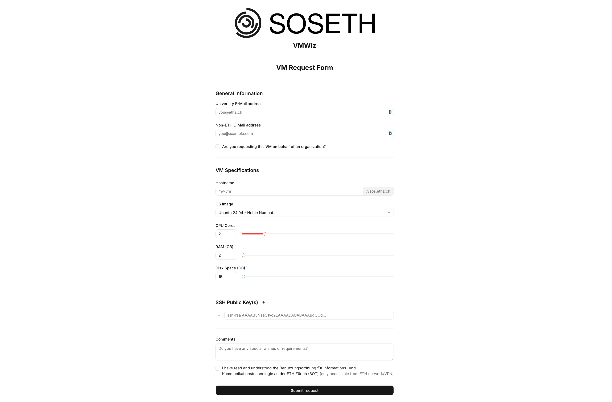
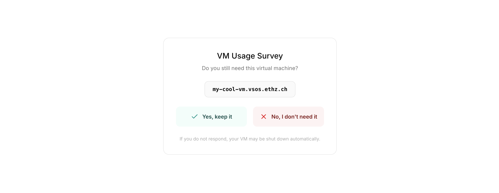
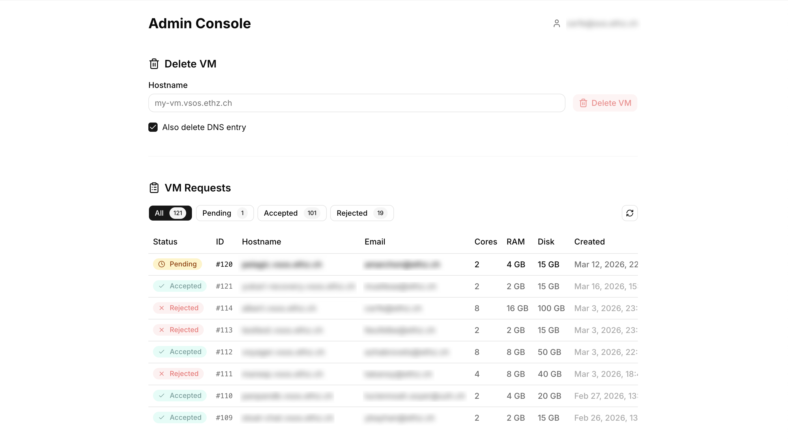
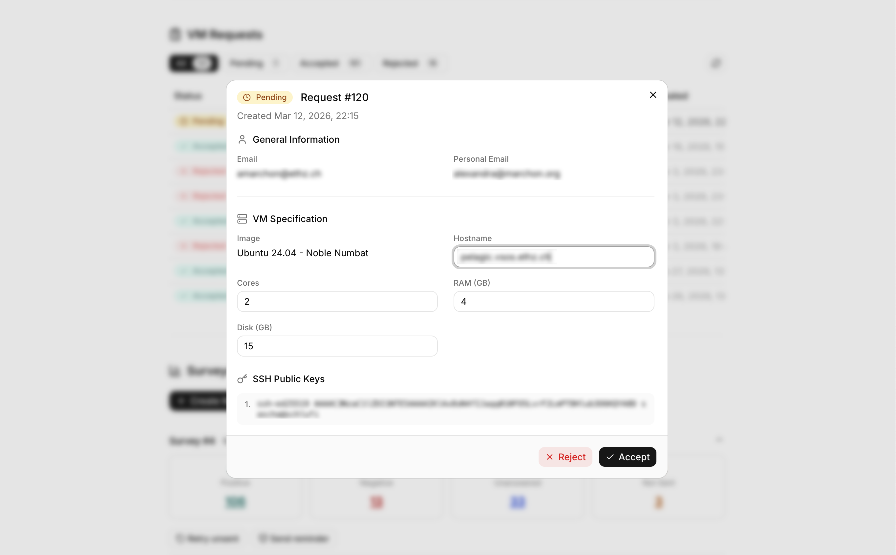
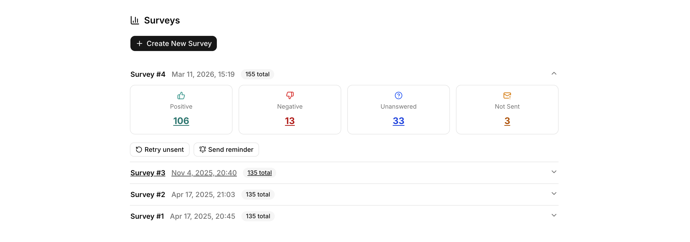
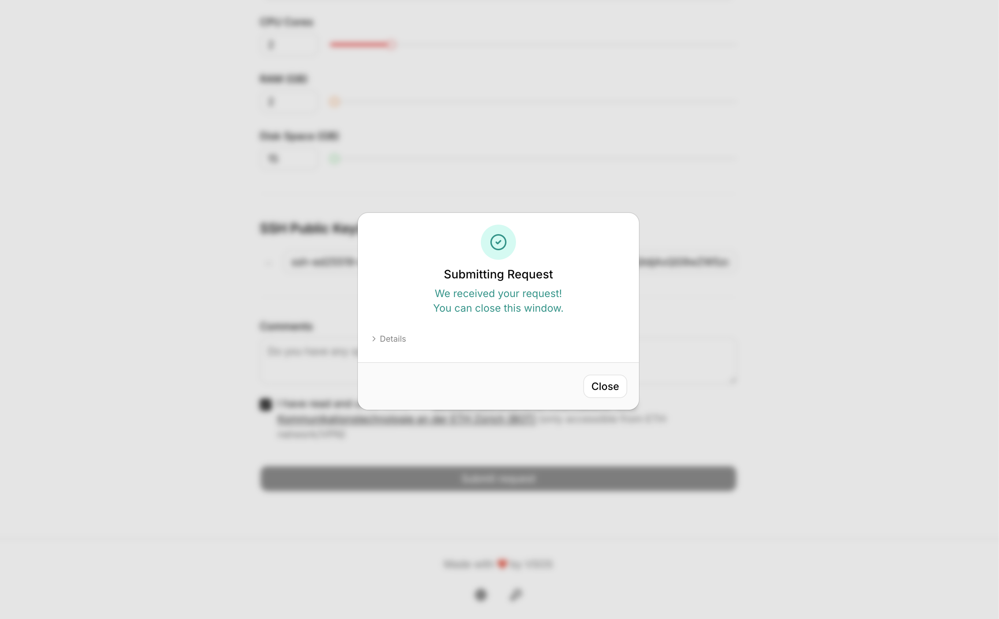

<h1 style="text-align:center"> VMWiz 🎩🪄 </h1>

VMWiz is a Go + Next.js tool by VSOS @ ETH Zurich that provisions and manages VMs on our Proxmox cluster. 

Students and organizations submit VM requests to VMWiz. Requests are audited by admins. VMWiz handles creation of new VMs, sets up DNS and reserves a public IP through ETH Zurich’s network stack, and helps clean up unused VMs by emailing users for confirmation.

At the moment of writing (2026.01.30) VSOS manages 260+ VMs free of charge for students and organizations using VMWiz.

_Main form_



_Survey page_



_Admin panel_







---
- [Application components](#application-components)
- [Production deployment](#production-deployment)
- [Bringing up the stack](#bringing-up-the-stack)
    - [1. Set `POSTGRES_PASSWORD` in .db.env](#1-set-postgres_password-in-dbenv)
    - [2. (Optional) Configure notification endpoints in notifier\_config.yml to receive notifications.](#2-optional-configure-notification-endpoints-in-notifier_configyml-to-receive-notifications)
    - [3. Modify PVE values inside .backend.env](#3-modify-pve-values-inside-backendenv)
    - [4. Setup SSH](#4-setup-ssh)
      - [5.1 Cluster Management node and Compute node](#51-cluster-management-node-and-compute-node)
      - [5.2 Default VM credentials](#52-default-vm-credentials)
    - [5. Modify Netcenter values inside of .backend.env](#5-modify-netcenter-values-inside-of-backendenv)
    - [6. Modify Keycloak values inside of .backend.env](#6-modify-keycloak-values-inside-of-backendenv)
    - [7. Adjust SMTP-related values in .backend.env](#7-adjust-smtp-related-values-in-backendenv)
    - [8. Bring up the stack](#8-bring-up-the-stack)
- [Environment variables](#environment-variables)
- [Proxmox](#proxmox)
---

# Application components
| Container | Description |
| --- | ----------- |
| **vmwiz-caddy** | Entrypoint of the application. Proxies all requests matching `/api/*` to `vmwiz-backend` and the rest to `vmwiz-frontend`. |
| **vmwiz-frontend** | Next.js frontend application built with React 19, TypeScript, TailwindCSS and shadcn components. |
| **vmwiz-backend** | Backend written in Go. While its main purpose is serving the API for the frontend, it also offers a CLI interface. This allows admins to optionally perform all the same operations in a GUI-less environment rather than from the frontend. Note: The backend uses the [Air](https://github.com/air-verse/air) utility for hot-reloading. |
| **vmwiz-db** | Postgres database for the backend |
| **vmwiz-notifier** | [Apprise](https://github.com/caronc/apprise) service allowing us to send notifications to a wide array of [supported services](https://appriseit.com/services/).


# Production deployment
When merging to `release` a CI pipeline creates a release, builds and publishes Docker images for the backend and frontend to the registry.

1. Copy the [docker/](docker/) folder to the target machine
2. Rename `docker-compose.prod.yml` to `docker-compose.yml`
3. Configure environment files and SSH keys as described in the section below
4. To pull images, you may need to authenticate with the registry. Create a [project access token](https://git.sos.ethz.ch/vsos/vmwiz.vsos.ethz.ch/-/settings/access_tokens), save it to `registry_token.txt` and run [docker_login.sh](docker/docker_login.sh)
5. Pull the images: `docker compose pull`
6. Bring up the stack: `docker compose up -d`

# Bringing up the stack

### 1. Set `POSTGRES_PASSWORD` in [.db.env](docker/.db.env)

### 2. (Optional) Configure notification endpoints in [notifier_config.yml](/docker/notifier_config.yml) to receive notifications.

### 3. Modify PVE values inside [.backend.env](docker/.backend.env)

### 4. Setup SSH
The backend estabilishes SSH sessions to the Cluster management (CM) node and the Compute node (CN). To that end, you need to supply valid SSH credentials.

#### 5.1 Cluster Management node and Compute node
  Populate [docker/ssh/cm_pkey.key](docker/ssh/cm_pkey.key) and [docker/ssh/comp_pkey.key](docker/ssh/comp_pkey.key) with valid private keys for the root user.
  Add the CM and Comp host fingerprints to the [docker/ssh/known_hosts](docker/ssh/known_hosts) file. Finally, adjust the related environment variables in [.backend.env](docker/.backend.env).

#### 5.2 Default VM credentials
  Each VM created through VMWiz will both accept the public key supplied by the requesting student/organization and another "universal" public key shared by every VM.
  Populate [docker/ssh/vm_univ_pubkey.key](docker/ssh/vm_univ_pubkey.key) and [docker/ssh/vm_univ_privkey.key](docker/ssh/vm_univ_privkey.key) with a valid key pair.

### 5. Modify Netcenter values inside of [.backend.env](docker/.backend.env)
The backend uses the Netcenter HTTP API, which requires authentication. To that end, insert the credentials of a valid user. 

### 6. Modify Keycloak values inside of [.backend.env](docker/.backend.env)
The backend has an OpenID client to authenticate SOSETH users. To that end, adjust the Keycloak-related environment variables in [.backend.env](docker/.backend.env).

### 7. Adjust SMTP-related values in [.backend.env](docker/.backend.env)
VMWiz has an LDAP user such that it can use SOSETH's mail server to send emails to VM owners.\
To that end, adjust the SMTP-related values in [.backend.env](docker/.backend.env).

### 8. Bring up the stack
`cd docker && docker compose up`\
You should now be able to navigate to https://localhost and access the frontend UI.

You can use the CLI tool by opening a Bash/Zsh/Fish shell in vmwiz-backend:
```bash
docker exec -it vmwiz-backend bash
```
And then from within the container:
```bash
vmwiz-backend --help
```
if the backend code changes, it will get recompiled automatically

# Environment variables
1. [.db.env](docker/.db.env) - Database variables
2. [.env](docker/.env) - General purpose environment variables\
Please refer to the documentation within [.env](docker/.env)


3. [.backend.env](docker/.backend.env) - Backend-specific environment variables\
Please refer to the documentation within [.backend.env](docker/.backend.env)

# Proxmox
To update to a new OS version:
- ssh onto `cm-lee.sos.ethz.ch`
- `cd /srv/cnfs/cloudinit`
- change `cloudinit-images.toml` to add the new version
- run `update-cloudinit-images -c cloudinit-images.toml`
