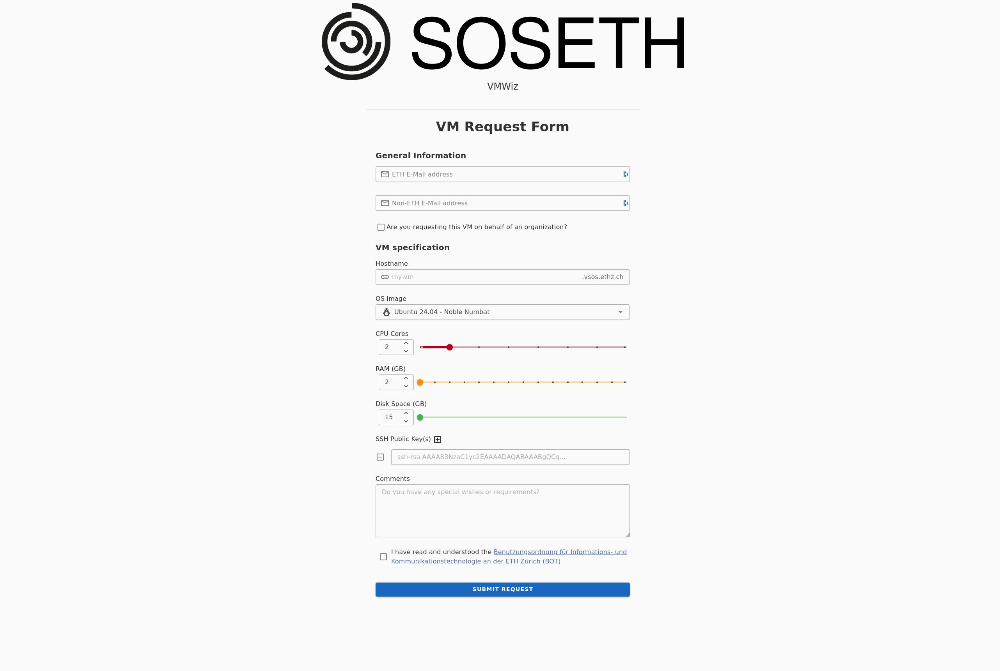

---
- [Application components](#application-components)
- [Bringing up the stack](#bringing-up-the-stack)
    - [1. Set `POSTGRES_PASSWORD` in .db.env](#1-set-postgres_password-in-dbenv)
    - [2. (Optional) Configure notification endpoints in notifier\_config.yml to receive notifications.](#2-optional-configure-notification-endpoints-in-notifier_configyml-to-receive-notifications)
    - [3. Modify PVE values inside .backend.env](#3-modify-pve-values-inside-backendenv)
    - [4. Setup SSH](#4-setup-ssh)
      - [5.1 Cluster Management node and Compute node](#51-cluster-management-node-and-compute-node)
      - [5.2 Default VM credentials](#52-default-vm-credentials)
    - [5. Modify Netcenter values inside of .backend.env](#5-modify-netcenter-values-inside-of-backendenv)
    - [6. Modify Keycloak values inside of .backend.env](#6-modify-keycloak-values-inside-of-backendenv)
    - [7. Adjust SMTP-related values in .backend.env](#7-adjust-smtp-related-values-in-backendenv)
    - [8. Bring up the stack](#8-bring-up-the-stack)
- [Environment variables](#environment-variables)
---

# Application components
| Container | Description |
| --- | ----------- |
| **vmwiz-caddy** | Entry point of the application. Proxies all requests matching `/api/*` to `vmwiz-backend` and the rest to `vmwiz-frontend`. Employs HTTPS by default. |
| **vmwiz-frontend** | Vue3 frontend application |
| **vmwiz-backend** | Go backend. Handles all requests matching `/api/*`. Note: The backend uses the [Air](https://github.com/air-verse/air) utility in development for hot-reloading. |
| **vmwiz-db** | Postgres database for the backend |
| **vmwiz-notifier** | [Apprise](https://github.com/caronc/apprise) service allowing us to send notifications to a multitude of services.

# Bringing up the stack

### 1. Set `POSTGRES_PASSWORD` in [.db.env](/.db.env)

### 2. (Optional) Configure notification endpoints in [notifier_config.yml](/docker/notifier_config.yml) to receive notifications.

### 3. Modify PVE values inside [.backend.env](.backend.env)

### 4. Setup SSH
The backend estabilishes SSH sessions to the Cluster management (CM) node and the Compute node (CN). To that end, you need to supply valid SSH credentials.

#### 5.1 Cluster Management node and Compute node
  Populate [docker/ssh/cm_pkey.key](docker/ssh/cm_pkey.key) and [docker/ssh/comp_pkey.key](docker/ssh/comp_pkey.key) with valid private keys for the root user.
  Add the CM and Comp host fingerprints to the [docker/ssh/known_hosts](docker/ssh/known_hosts) file. Finally, adjust the related environment variables in [.backend.env](.backend.env).

#### 5.2 Default VM credentials
  Each VM created through VMWiz will both accept the public key supplied by the requesting student/organization and another "universal" public key shared by every VM.
  Populate [docker/ssh/vm_univ_pubkey.key](docker/ssh/vm_univ_pubkey.key) and [docker/ssh/vm_univ_privkey.key](docker/ssh/vm_univ_privkey.key) with a valid key pair.

### 5. Modify Netcenter values inside of [.backend.env](.backend.env)
The backend uses the Netcenter HTTP API, which requires authentication. To that end, insert the credentials of a valid user. 

### 6. Modify Keycloak values inside of [.backend.env](.backend.env)
The backend has an OpenID client to authenticate SOSETH users. To that end, adjust the Keycloak-related environment variables in [.backend.env](.backend.env).

### 7. Adjust SMTP-related values in [.backend.env](.backend.env)
VMWiz has an LDAP user such that it can use SOSETH's mail server to send emails to VM owners.\
To that end, adjust the SMTP-related values in [.backend.env](.backend.env).

### 8. Bring up the stack
`cd docker && docker compose up`\
You should now be able to navigate to https://localhost and access the frontend UI.

# Environment variables
1. [.db.env](/.db.env) - Database variables
2. [.env](.env) - General purpose environment variables\
Please refer to the documentation within [.env](.env)

3. [.backend.env](.backend.env) - Backend-specific environment variables\
Please refer to the documentation within [.backend.env](.backend.env)

